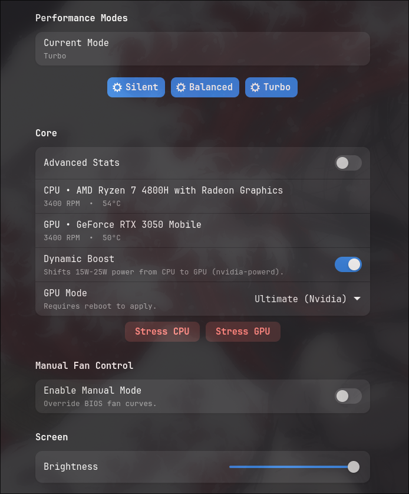
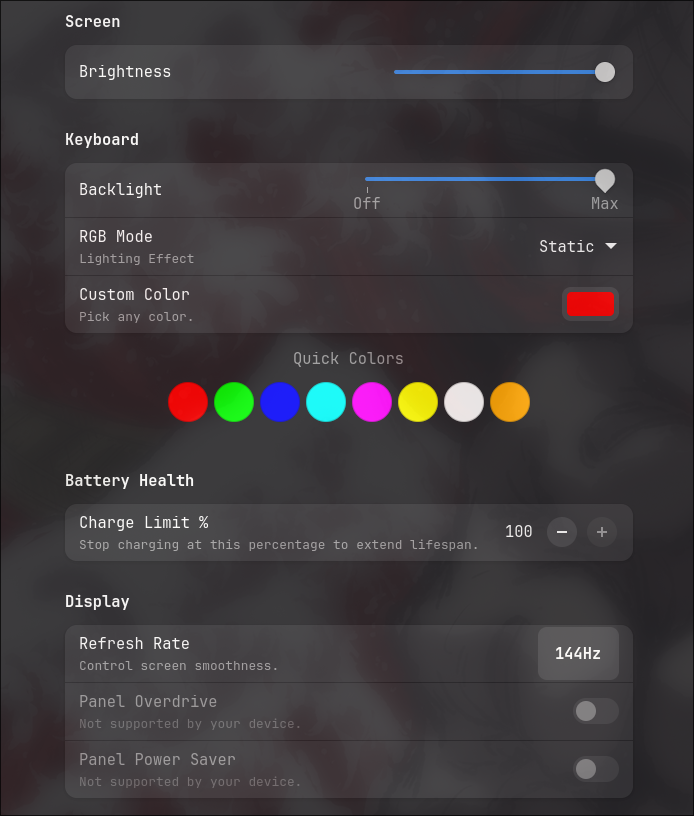

# Asus Armoury Control Plugin

**Asus Armoury Control** is a lightweight Kerneldrive plugin that exposes a set of laptop hardware controls and diagnostics for supported Asus systems.

---

## Features

- **Performance modes**: Switch between Silent, Balanced and Turbo
- **Battery charge limiting**
- **Manual fan control**
- **Display controls**: display stuff
- **Keyboard controls**: RGB control
- **GPU features**: Dynamic Boost control and Mux switch
- **Stress testing helpers**: UI buttons to launch `stress-ng` and `gpu_burn` if installed.
- **more**

---

## Usage

1. Download [KernelDrive](https://github.com/acedmicabhishek/KernelDrive)
2. Open KernelDrive → Plugin Store → Search **Asus Armoury Control** → Install
3. Reboot and enjoy the features